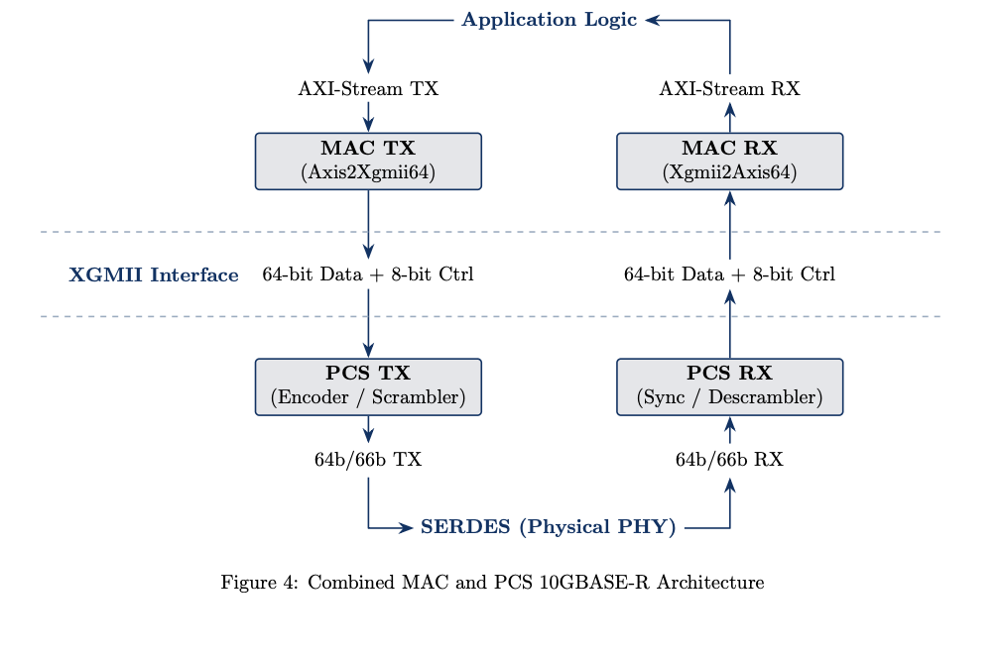

# ClockDomainCrew – 10G Ethernet MAC
A high-performance, parameterized 10 Gigabit Ethernet Media Access Control (MAC) core implemented in Chisel. Developed as a Capstone design project at the University of Calgary (2026).

## Project Overview
This repository contains the MAC (Media Access Control) layer. It implements the digital logic required to bridge packet-based application logic (AXI-Stream) with the 64-bit XGMII interface used in 10GBASE-R style architectures.

### Key Features
- **Full-Duplex Operation:** Independent 64-bit Transmit (TX) and Receive (RX) datapaths.
- **Standard Compatibility:** Strict adherence to 10GbE framing requirements.
- **Hardware Optimizations:** Parallel LFSR for single-cycle CRC-32 (FCS) generation/verification and Deficit Idle Count (DIC) for maximum throughput.
- **PTP Support:** Optional IEEE 1588 Precision Time Protocol timestamping with nanosecond accuracy.

## System Architecture
The MAC acts as the primary orchestrator between the user application and the physical link. For a complete Ethernet solution, this module is designed to interface with our [PCS Core](https://github.com/eddie-an/ClockDomainCrew-PCS)



## Documentation
Technical specifications, state machine diagrams, and timing results are maintained in the LaTeX-generated User Guide.
- User Guide Path: `modules/mac/docs/user-guide/`
- To Build: Ensure pdflatex is installed and run `make docs`. This should generate a `Mac.pdf` file.

## Getting Started
### Dependencies
- Hardware Construction: `sbt`, `Chisel3`, `CIRCT/FIRRTL`
- Simulation: `Verilator`
- Synthesis & Timing: `Yosys (v0.9+)` and `OpenSTA (v2.4.0+)`

### Usage
The project utilizes a top-level `Makefile` to wrap the Chisel/sbt workflow.

The following table lists all the `Makefile` commands to run various actions.

| Action | Command | Output Location/File |
|---|---|---|
Compile | `sbt compile` | `target/`
Generate Verilog | `make verilog` | `modules/mac/generated/`
Run Synthesis | `make yosys` | `modules/mac/generated/synTestCases/`
Run Tests | `make test` | `modules/mac/generated/test.rpt`
Run Test Coverage | `make cov` | `modules/mac/generated/scalaCoverage/`
Build PDF Guide | `make docs` | `modules/mac/docs/user-guide/Mac.pdf`
Full Regression | `make all` | `modules/mac/generated/error.rpt`

### Prerequisites for Tests

#### Verilator (Required)

This project requires **Verilator v5.044 or v5.045**, built using **Clang/clang++**.

Some environments may run into Verilator PCH / build issues when Verilator is compiled with `g++` (e.g., missing file paths during compilation). Building Verilator with **Clang** resolves this reliably. Newer Verilator versions also improve support for the SystemVerilog golden model, but this project is validated against **v5.044** and **v5.045**.

##### Build Verilator with Clang

Clone Verilator, check out the appropriate release, then build/install:

```bash
export CC=clang
export CXX=clang++

autoconf
./configure
make          # this may take a while
sudo make install
```

##### If you previously installed Verilator via Ubuntu packages, ensure the /usr/local/bin install takes precedence:

```bash
export PATH=/usr/local/bin:$PATH
```

#### Java (Required)

##### Java JDK 17 is required to run and integrate with the blackbox implementation of the golden model.

##### Switch your system Java to JDK 17
```bash
sudo update-alternatives --config java
```

Select the java-17 option.
If java-17 is not listed, install JDK 17 first, then re-run the command above.

## Repository Structure

```
ClockDomainCrew/
├── build.sbt                   # Build tools
├── Makefile                    # Chisel workflow file
├── docs/                       # Project-level reports
├── modules/
│   └── mac/                    # MAC module
│       ├── docs/
│       │   └── user-guide/     # Technical Specification Document
│       ├── generated/          # Generated files
│       ├── src/
│       │   ├── main/           # Source code
│       │   └── test/           # Testbench
│       └── target/             # Scala output target
├── Scapy-Tests/                # Loopback tests using Scapy 
└── project/                    # sbt plugins and build configuration
```

## License 


This project is licensed under the **CERN Open Hardware Licence v2 – Strongly Reciprocal (CERN-OHL-S-2.0)**.

Under this license you are free to:
- Use the hardware design and documentation
- Modify the source and create derivative works
- Manufacture and distribute products based on the design
- Share the design publicly

However, the following conditions apply:
- Any modifications or derivative works must also be released under **CERN-OHL-S-2.0**
- Copyright and license notices must be retained
- When distributing products based on this design, the **complete corresponding source** must be made available

This design is provided **“as is” without warranty**. The authors are not liable for any damages resulting from its use.

See the `LICENSE.md` file or the official license text for full details:
https://ohwr.org/cern_ohl_s_v2.txt

### Upstream Work

This project is based in part on the taxi repository:

https://github.com/fpganinja/taxi

Original work:
Copyright (c) 2015–2025 FPGA Ninja, LLC  
Author: Alex Forencich

Modifications and additional development:
Copyright (c) 2026 ClockDomainCrew  
University of Calgary – Schulich School of Engineering

Project Sponsor:
ChiselWare

## Authors

ClockDomainCrew
University of Calgary
2026
Electrical Engineering Capstone Project